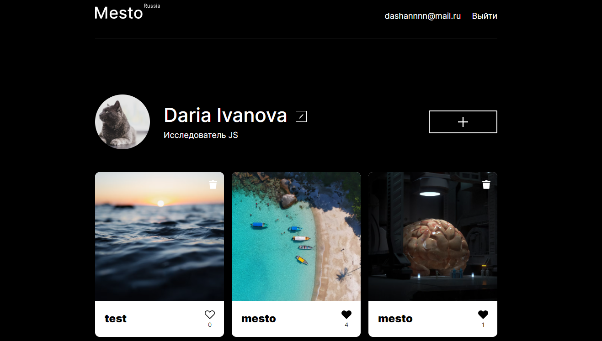

# Проект: Место

Приложение для просмотра чужих и размещения собственных фотографий мест, где Вы были или только хотите побывать.

## О проекте

Версия проекта Mesto, написанная на React.  
В проекте добавлена возможность авторизации и регистрации пользователей с возможностью выхода, сохранены прежние возможности - адаптация под различные размеры экранов, модальные окна для редактирования персональной информации, добавления постов на страницу, просмотра фотографий крупным планом, работают кнопки добавления/удаления лайков к постам, удаления постов, для удаления постов реализовано всплывающее окно для подтверждения. Вся информация загружается с сервера и отправляется на сервер при изменении данных.  
Используются: функциональные компоненты, подписка на контекст, стейт-переменные, управление жизненным циклом с помощью useEffect, анимация для индикации при отправке формы.

### Стек:
* HTML
* CSS
* JS
* React

## Установка зависимостей и запуск проекта

##### `npm i` – установить зависимости

##### `npm start` – запуск devServer на http://localhost:3000/

##### `npm run build` – production сборка проекта

Макет предоставлен: _Я.Практикум_.

[Ссылка на проект в GH Pages](https://dariy-iva.github.io/react-mesto-auth/)
